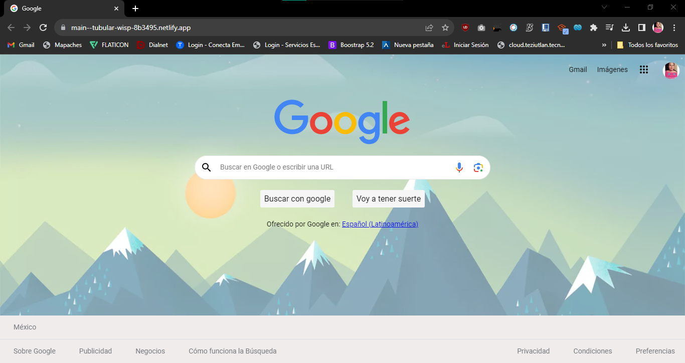

# Clon de Google con HTML Y CSS

El proyecto consiste en una página web realizada en el bootcamp de TecnolochicasPRO, la cual consisste principalmente en el uso y conocimiento de las estructuras básicas de HTML y CSS que permiten manipular elementos a nuestra manera, de forma que se realizó tal cual la copia de la página de inicio de www.google.com

## Contenido

- [Demo](#demo)
- [Descripción](#descripción)
- [Contacto](#contacto)

## Demo

La página del clon de google luce actualmente de la siguiente manera: 

## Descripción

El clon de Google se compone principalmente de elementos básicos de HTML los cuales están organizados mediante etiquetas, contienen comentarios para poder hacer una navegación más específica. De la misma manera, contiene un archivo de CSS que contiene todos los elementos de diseño para la página como colores, bordes, anchos y altos, étc.
La carpeta principal contiene una carpeta de assets en donde se encuentran todas las imágenes que se ocuparon para la construcción de la página.

## Tecnologías empleadas

* 
* 

## Contacto

La aplicación web podrá ser visualizada en el siguiente enlace:
https://main--tubular-wisp-8b3495.netlify.app/

© 2023 Alma Lilia Martínez Landero. Bootcamp de TecnolochicasPRO

